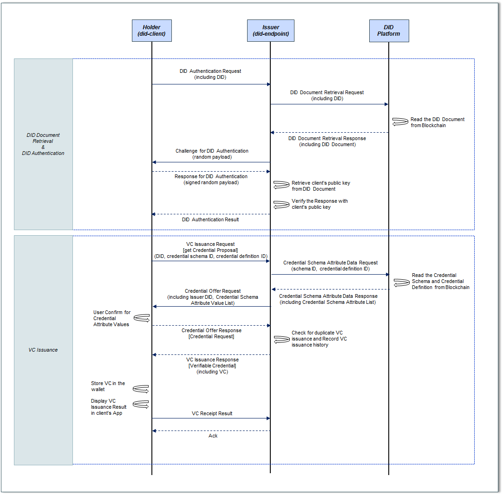
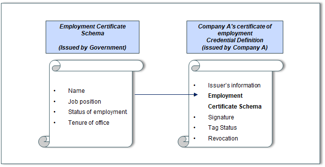
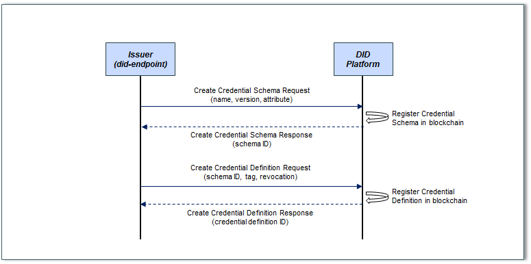

VC Issuance
====================================

Did-endpoint performs the issuer function for issuing the holder's VC (Verifiable Credential). Hereinafter, did-endpoint is referred to as an issuer.

The VC (Verifiable Credential) issuance is a function in which a holder issues a VC through an issuer.

In VC issuance, the holder receives an identity certificate from the issuer to prove the holder's ID attribute, and the identity proof corresponds to a resident registration card, graduation certificate, employment certificate, and certificate.

VC Elements
====================================
VC consists of the following elements.
- Credential metadata: Defines the VC issuer, VC expiration period, VC disposal method, and the object specified by the VC.
- Claim(s) : Information about the identity property of the credential subject is stored in the subject-property-value method. For example, holder name (subject) - major (property) - computer (value), which includes information about which property for a given subject and what the value of that property is.
- Proof(s): Contains the value required to verify the authenticity of the VC. Various cryptographic techniques for verification, such as RSA and biometrics, can be used.

VC Issuance Procedure
====================================
The VC issuance procedure is as follows.

 
Credential Schema and Credential Definition Registration
++++++++++++++++++++++++++++++++++
Before a holder is issued a VC (Verifiable Credential) through an issuer, the issuer must register the Credential Schema and Credential Definition in the Blockchain in advance for VC issuance.

Credential Schema is the data that defines the items for the holder's basic properties among the identity proof forms. For example, basic components (schema) such as graduation certificates or employment certificates issued by institutions such as schools or companies are set by the government. The government defines and creates a schema form and registers it with the government's DID and authentication key on the blockchain.

In Credential Definition, the issuer fills in the holder's ID attribute value in the Credential Definition including Credential Schema, and then issues an identity certificate to the holder along with an additional field. For example, each company that issues the employment certificate defines the employment certificate by including the basic component (schema) of the employment certificate and adding additional fields for each company. Each company retrieves the Credential Schema to be created from the Blockchain, defines and creates the Credential Definition for the VC to be issued, and registers it in the Blockchain. Credential Definition includes who issued it, what schema it was based on, and how it was signed with the VC.

The figure below is an example of Credential Schema and Credential Definition for employment certificate.

As shown in the figure below, the issuer requests the DID Platform to register Credential Schema and Credential Definition and registers it in the Blockchain. When registration is completed, DID Platform sends the Schema ID and Credential Definition ID to the issuer.

Credential Schema includes name (eg, employment certificate), version, and attribute (attribute). Attribute includes, for example, name, title, tenure, and the like in the case of a certificate of employment.

Credential Definition includes schema ID (whether it is based on which credential schema), tag, revocation, etc.

The VC issuance procedure is as follows.

First, for VC issuance, the holder must obtain information (Credential Schema and Credential Definition) necessary for VC issuance from the issuer prior to the VC issuance request. This process requires the holder to know the issuer's information online or offline. (Example: Visiting government agencies to issue a resident registration card, visiting a school or online school website to issue a graduation certificate, etc.)

In this project, the issuer has registered the Credential Schema and Credential Definition in the block chain in advance, and there is an online connection between the holder and the issuer.

DID Document Retrieval
++++++++++++++++++++++++++++++++++
Before requesting VC issuance, the holder should request the issuer to perform DID authentication to confirm that the owner of the DID is correct. For DID Authentication, it is necessary to first retrieve the DID Document of the holder's DID from the block chain.

When the holder sends own DID to the issuer, the issuer requests the holder's DID Document retrieval to the DID Platform. The DID Platform checks the location where the holder's DID Document is stored, obtains the DID Document from the Blockchain, and sends it to the issuer.

DID Authentication
++++++++++++++++++++++++++++++++++
After that, the issuer performs the DID Authentication procedure to verify that the DID owner is the holder. The issuer acquires the user's public key from the obtained DID document and sends a challenge (eg, random payload generation) to authenticate that the DID is the DID created by the holder, and the holder responds (eg, : Send a random payload encrypted with a private key). The issuer receiving the response verifies the holder's response using the public key included in the holder's DID document. When the verification is completed, the issuer sends the DID authentication result (true/false) to the holder.

VC Issuance
++++++++++++++++++++++++++++++++++
When the DID Authentication procedure is completed, the holder makes a VC issuance request together with information (Credential Schema ID, Credential Definition ID) about which VC to issue to the Issuer.

Then, the issuer transmits the received VC issuance information (Credential Schema ID, Credential Definition ID) to the DID Platform, and the DID Platform retrieves the information to the Blockchain and sends it to the Issuer. The information searched on the blockchain includes the attribute list of Credential Schema, which is the form required for VC issuance, and the issuer who received the information fills in the value for each attribute and delivers it to the holder. do. The content includes the contents of the VC to be issued (values for each property to be entered into the VC), and it sends a confirmation request to the holder to issue the VC with this content, which is called Credential Offer.

If the holder confirms and confirms the VC content (credential offer) received from the issuer, the final request to issue a VC with the content is delivered to the issuer. In this task, the holder's confirmation proceeds automatically.

Then, the issuer checks whether there is any overlap with the previously issued VC for the VC to be issued, and if there is no problem, issues the holder's VC and records it in the VC issuance history. The issuer sends the issued VC to the holder, and the holder stores the VC in the DID Wallet and shows the VC issuance status on the App screen.

Finally, the holder sends the result that the VC has been successfully received to the issuer, and the issuer sends an Ack to the holder to complete the VC issuance procedure.

