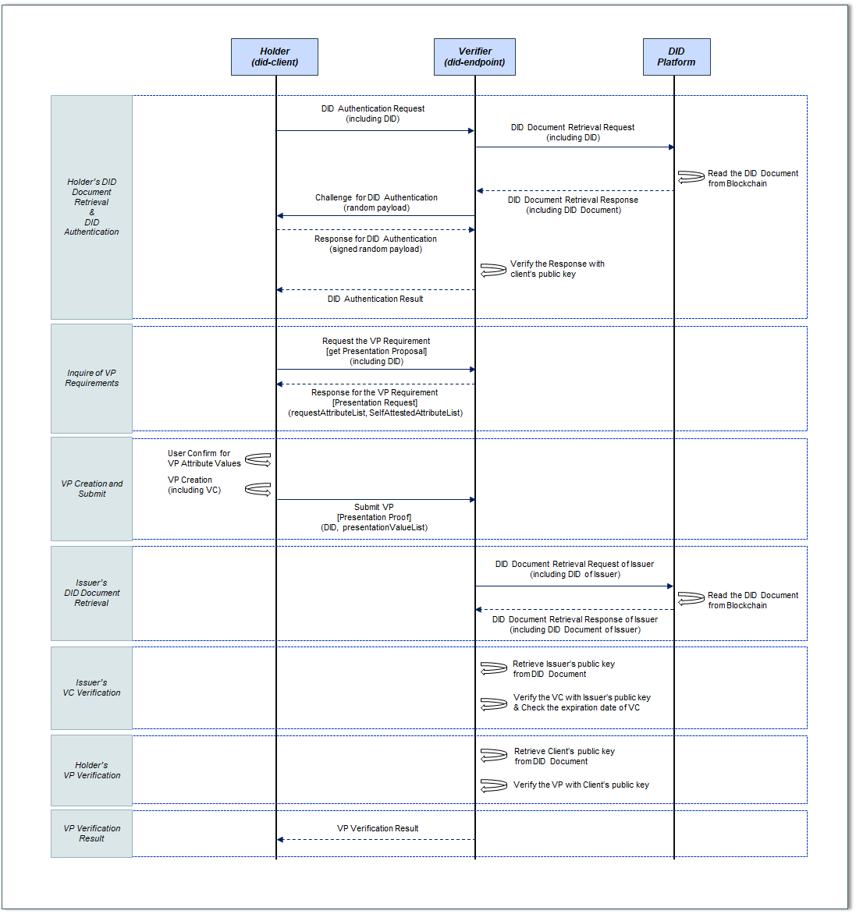

VP Creation and Verification
===================================

Did-endpoint performs the verifier function for verifying VP (Verifiable Presentation) created and submitted by the holder. Hereinafter, did-endpoint is called verifier.

The VP (Verifiable Presentation) verification is a function to submit and verify the VP generated by the holder to the verifier.

When a holder applies for a job at a company or wants to receive a rental car discount, the verifier may request the holder for a graduation certificate/resident registration card or driver's license/discount voucher. In this case, the holder does not submit the VC (ex. graduation certificate, driver's license, etc.) to the verifier (ex. company or rental car company) as it is. The holder extracts only the necessary properties from among the VC properties based on the content requested by the verifier to create the VP, and then add holder's signature within VP and submit the created VP.

VP Elements
===================================
VP consists of the following elements:
- Presentation metadata: Definition of data that can be referenced for VP verification, such as specifying the type of VP, terms of use, evidence, etc.
- Verifiable Credential(s): VC is included. The VC can be put in as it is, or only claims with attributes required by the verifer can be selected and included among claims existing within the VC.
- Proof(s): The value required to verify the authenticity of the VP is included. Various cryptographic techniques for verification, such as RSA and biometrics, can be used.

VP Procedures
===================================
VP procedures are as follows.
 

For example, the holder wants to apply for a job application by accessing a recruitment company (hereinafter, a verifier) homepage. In this case, the holder should be informed of the VP requirements (eg, required documents for job application) from the verifier.

To do this, the holder has to obtain the information required for VP creation from the verifier in order to create VP (Recruitment Application Document), and collect the data required for VP creation request from the block chain. This process requires the holder to know the verifier's information and proceed online or offline. (Example: visiting the company's online site for job application, etc.) In this project, it is assumed that the holder and the verifier are connected online.

Holder's DID Document Retrieval
+++++++++++++++++++++++++++++++++++
Before VP creation, the holder should request the verifier to perform DID authentication to confirm that the owner of the DID is correct. For DID Authentication, it is necessary to first retrieve the DID Document of the holder's DID from the block chain.

When the holder sends own DID to the verifier, the verifier requests the holder's DID Document retrieval to the DID Platform. The DID Platform checks the location where the holder's DID Document is stored, obtains the DID Document from the Blockchain, and sends it to the verifier.

Holder's DID Authentication
+++++++++++++++++++++++++++++++++++
After that, the verifier performs the DID Authentication procedure to verify that the DID owner is the holder. The verifier acquires the user's public key from the obtained DID document and sends a challenge (eg, random payload generation) to authenticate that the DID is the DID created by the holder, and the holder responds (eg, : Send a random payload encrypted with a private key). The verifier receiving the response verifies the holder's response using the public key included in the holder's DID document. When the verification is completed, the verifier sends the DID authentication result (true/false) to the holder.

Inquirer of VP Requirement
+++++++++++++++++++++++++++++++++++
When the DID Authentication procedure is completed, the holder inquires the Verifier for the requirements for VP issuance (what content should be included in the VP). Then, the verifier sends the attribute list to be included in the VP to the holder. The attribute List includes mandatory submission items and optional submission items.

VP Creation and Submit
+++++++++++++++++++++++++++++++++++
The holder creates the VP by adding the value for the attribute list to be included in the VP received from the verifier. VP is created based on the contents of VCs owned by the holder. The holder sends the created VP to the verifier.

Issuer's DID Document Retrieval
+++++++++++++++++++++++++++++++++++
After that, the verifier first verifies the VC included in the VP to verify the VP.

VC verification is to verify that the issuer is the issuer who issued the VC and whether the VC has not been forged and verified based on the issuer's signature (Proof) included in the VC.

The verifier obtains the issuer's DID (specified by the verificationMethod item in the proof in the VC) included in the VP's VC. A verifier is a DID platform and requests a DID document to the blockchain along with the issuer's DID information. The DID Platform checks the location where the issuer's DID document is stored, obtains the DID document from the blockchain, and sends it to the verifier.

Issuer's VC Verification
+++++++++++++++++++++++++++++++++++
Then, the verifier verifies the VC signature with the public key of the issuer included in the received DID Document.

VC verification is to verify that the issuer is the issuer who issued the VC and whether the VC has not been forged and verified based on the issuer's signature (Proof) included in the VC.

In addition, the verifier also checks the expiration date included in the VC. If the expiration date has passed, the verifier delivers the VC verification result fail (expiration of the validity period) to the user and ends the VP verification procedure.

Holder's VP Verification
+++++++++++++++++++++++++++++++++++
After that, the verifier verifies the signature on the VP with the public key of the holder included in the DID Document searched during DID Authentication of the holder for VP verification. VP is verified based on the signature (Proof) item of the holder included in the VP.

VP Verification Result
+++++++++++++++++++++++++++++++++++
If the issuer's VC and the user's VP signature verification are completed (successful), the verifier sends the result that the VP verification is complete to the holder.
